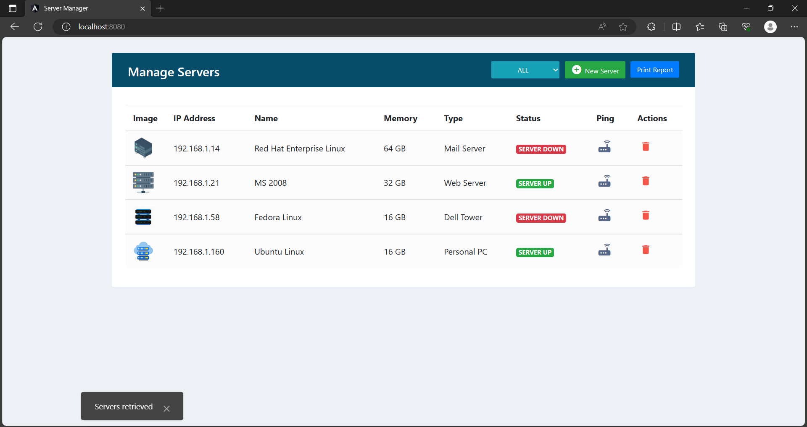

# Server Manager

Clone the repository with the following command:

```
git clone https://github.com/maz22374/servermanager.git
```

## Project description



The ServerManager project is a versatile and efficient solution for server administration and monitoring. This project simplifies server management tasks, including server creation, updates, deletions, and real-time status monitoring. Developed with a Spring Boot backend and an Angular frontend, it offers a user-friendly interface for comprehensive server management.

## Requirements

To build and run this project, you will need the following prerequisites:

**1. Java**

The project uses Java version 17. Use the following command to check whether the Java JDK version 17 is installed on the computer:

```
java --version
```

The Java 17 JDK (LTS version) can be downloaded for all platforms from the official website: [Java Installation](https://www.oracle.com/java/technologies/downloads/#java17)

**2. Maven**

This project uses Maven as a build and dependency management tool. Use the following command to check whether Maven is installed on the computer:

```
mvn --version
```

You can download and install Maven from the official website: [Maven Installation](https://maven.apache.org/download.cgi)

**3. Node.js**

The Angular frontend relies on Node.js and npm (Node Package Manager) for its development and build processes. You can download and install Node.js from the official website: [Node.js Downloads](https://nodejs.org/en/download/)

Verify your Node.js and npm installations by running the following commands in your terminal:

```
npm -v
```

**4. Docker**

The Spring Boot backend utilizes a MySQL database for storing data, and it is hosted within a Docker container. To install Docker, please visit the official website and download it from the following link: [Docker Download](https://www.docker.com/products/docker-desktop/)

After installing Docker, you can verify its installation by running the following command in your terminal:

```
docker -v
```

